# Full Installation of Scouti

Thank you for using this project to search for software. We introduce an evaluation of reviews and descriptions of software. Therefore, four systems need to be set up.
-	RapidMiner AI Hub
-	Google Programmable Search Engine
-	MeaningCloud API Access
-	Web-Application: _Scouti_

Disclaimer: The software provided is a prototype. It is not guaranteed that the results are stable.

In the last section a table is added where credentials can be noted down. This is useful to not always have to look them up. If the text mentions to note down something, it references the table.

## Content

- [Google Programmable Search Engine](#google-programmable-search-engine)
- [MeaningCloud API Access](#meaningcloud-api-access)
- [RapidMiner AI Hub](#rapidminer-ai-hub)
- [Web-Application Scouti](#web-application-scouti)
- [Hot Stuff](#hot-stuff)

## Google Programmable Search Engine

If not already existing, create a Google account. For _Scouti_, two programmable search engines are needed. The first has a whitelist of websites that are taken into account and the second one is an open request to scout the whole internet.

Further, the first has more configurations that are done.

### Installation

In  the browser visit the page https://programmablesearchengine.google.com/controlpanel/all to create the needed search engines.

Select Add to create a new search engine.

#### First Search Engine

Choose a name (only visible to the maintainer of the search engine) and enter the list of websites.
- https://g2.com
- https://pcmag.com
- https://www.financesonline.com/
- https://www.trustpilot.com/
- https://www.softwaresuggest.com/
- https://www.medium.com/
- https://www.softwarereviews.com/
- https://www.trustradius.com/
- https://www.itcentralstation.com/
- https://www.softwareadvice.com/resources/
- https://www.softwareworld.co/

Further websites can be added if wanted. This selection is what has been selected by the project team.

After the confirmation of creation, enter the control panel to further customize the search engine: In the section Search engine keywords enter the keyword software.

Further, the search engine ID has to be noted down because it is needed in a later point.
Now the second search engine can be created.

To be able to call the API, a personal API key must be accessed. The key can be found in the Google Cloud Console https://console.cloud.google.com under the section “APIs and services”.

#### Second Search Engine

Choose a name and select the option search entire web. Create the search engine and note the search engine ID.

When these two parts are done, the configuration of the programmable search engines is finished.

## MeaningCloud API Access

If not already existing create an account or login: https://www.meaningcloud.com/developer/login

After the successful registration process navigate to the page https://www.meaningcloud.com/developer/account/subscriptions where the license key for the MeaningCloud API can be accessed. Note down this key for further use.

Now that the access to the programmable search engine and the MeaningCloud API has been created RapidMiner can be deployed and configured.

## RapidMiner AI Hub

RapidMiner is a state-of-the-art data processing tool. It enables fast processing of large amounts of information. It can be used as a desktop application (RapidMiner Studio) or on a remote server with the RapidMiner AI Hub. The process we designed uses the latter. In this section we show how to install an instance of the AI Hub on a server.

In this section it is only described how to run the process on AI Hub. If it is needed to run the process locally in RapidMiner Studio, it is needed to install some further required packages. Find further information in the section Run Locally.

### Preconditions

To be able to easily configure the process, it is recommended to install RapidMiner Studio on the working machine.
-	Visit the following website and follow the installation guide: https://rapidminer.com/products/studio/  
     For the installation, an account is needed

There are three (or more) way to install the AI Hub instance (https://docs.rapidminer.com/latest/deployment/). We chose to deploy it on a server with a pre-configured docker environment.
-	Visit https://docs.hetzner.com/de/cloud/apps/list/docker-ce/ for more information.

### Installation

If the server with docker is up and running, enter the console with ssh
- e.g. root@ip.to.remote.server

Follow these steps to install the AI Hub instance: (based on https://docs.rapidminer.com/latest/deployment/docker-compose/)

Check if the following programs installed and install them if not
- docker-compose (If not follow the official guide: https://docs.docker.com/compose/install/)
- wget
- unzip

Get the AI Hub package from RapidMiner
```
$ wget https://docs.rapidminer.com/assets/download/hub/rapidminer-ai-hub-9.10.0-docker-compose-template-prod.zip
```
Open the downloaded file
```
$ unzip rapidminer-ai-hub-9.10.0-docker-compose-template-prod.zip
```
Change directory to prod/
```
$ cd prod/
```
Open the .env file
```
$ nano prod/.env
```
Edit the following variables:
- In section Global parameters
  - `LEGACY_REST_BASIC_AUTH_ENABLED=true`  
- In section RapidMiner server
  - `SERVER_LICENSE=YourLicenseKey`
Run docker compose
```
$ docker-compose up -d rm-init-svc
$ docker-compose up -d
```

The AI Hub should now be available with the IP of the server and when the site is loaded, there should be the login interface. With the credentials `User: admin` and `Password: changeit` the RapidMiner AI Hub can now be accessed and further configured. It is recommended to change the password for admin immediately. This can be done in the user-management.

Keep the user and password noted for further configurations.

Now, we proceed with initiating the _Scouti_ process. Therefore, open RapidMiner Studio.

### Configuration

This subsection describes the configuration of the connections and the process.

#### Connections

To be able to communicate with external services, there are several connections that need to be established. First, the AI Hub, then the Database, and third the connection to the MeaningCloud have to be configured.

##### AI Hub

In RapidMiner Studio, we first need to connect to the newly created server. In the tab Repository, open the context menu on AI Hub Repository and select Configure Repository. In the window, enter the IP-Address to the server and select RapidMiner AI Hub / Enterprise Login.

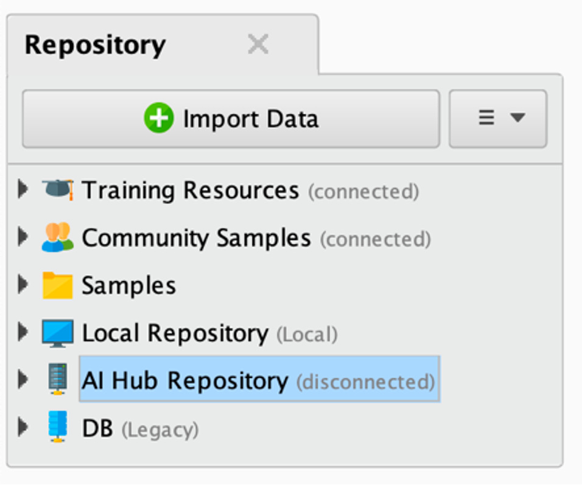

After the confirmation Check & Save, a window opens. Enter the credentials for the admin user. The connection now should be established.

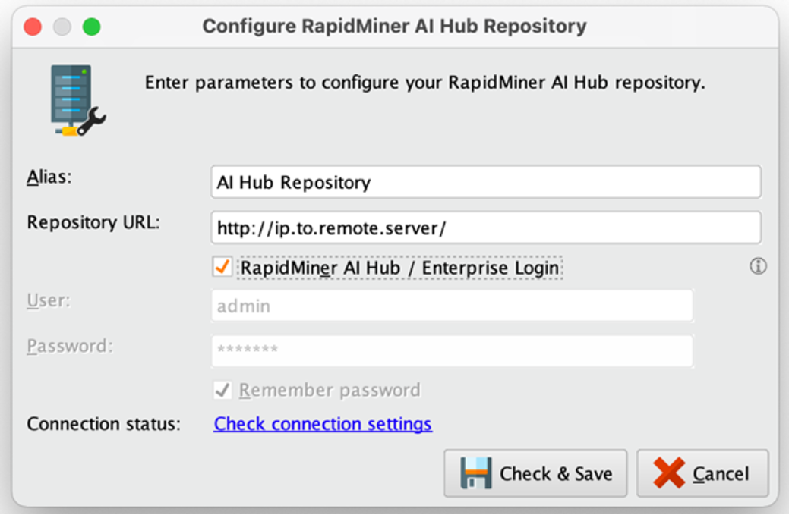

##### Database

In the tab Repository select the menu item AI Hub Repository > Connections and select Create Connection.

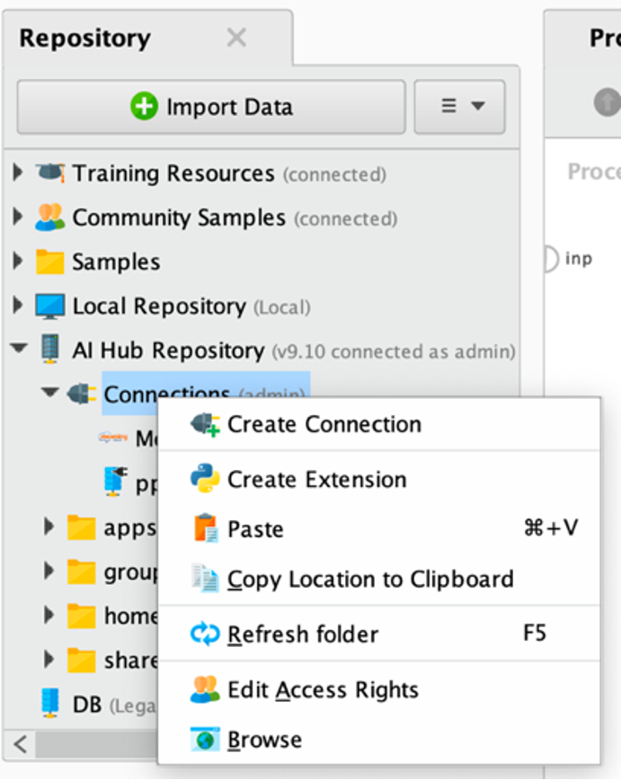
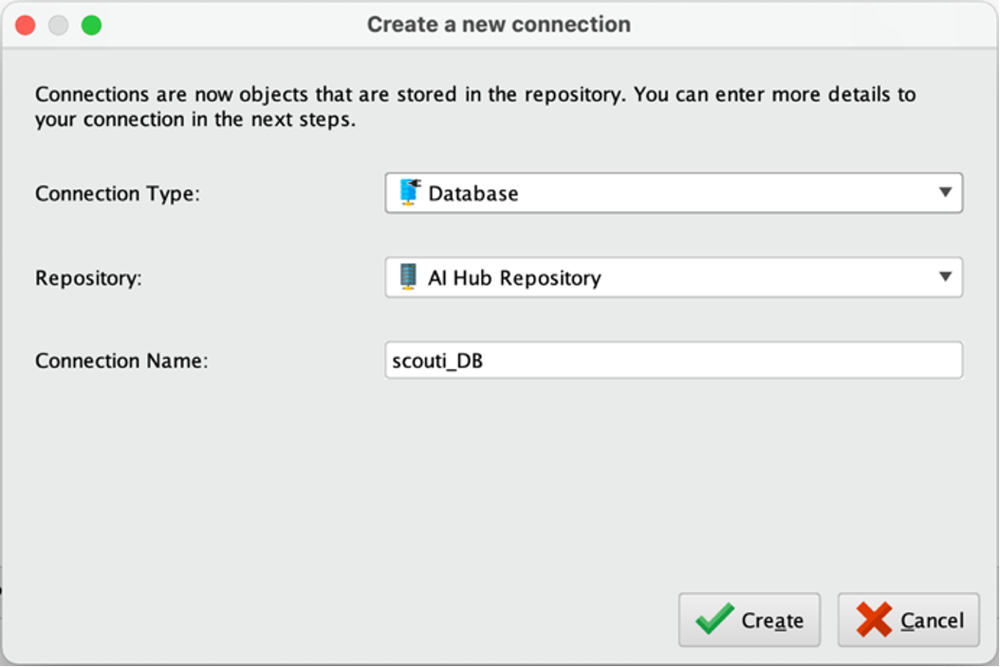
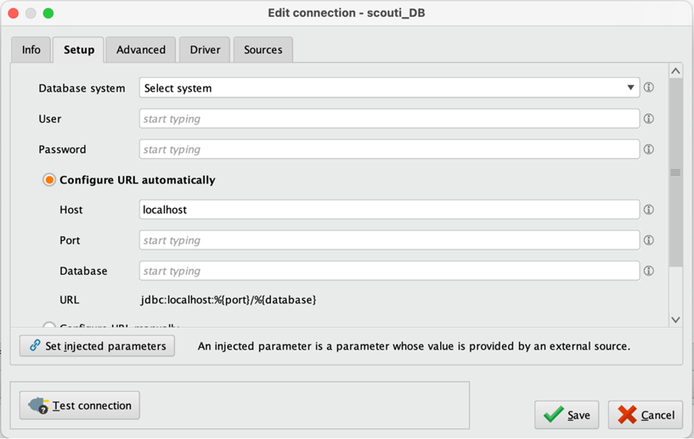

##### MeaningCloud
Adding a connection of MeaningCloud is parallel to the one described before. Instead of choosing Database as Connection Type, now the connection is MeaningCloud.

After Create, only the API key has to be added and then saved.

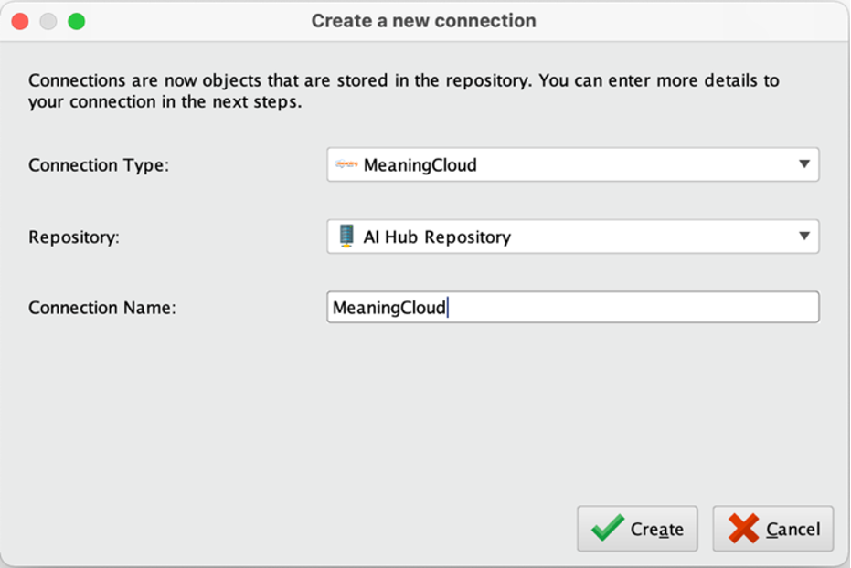
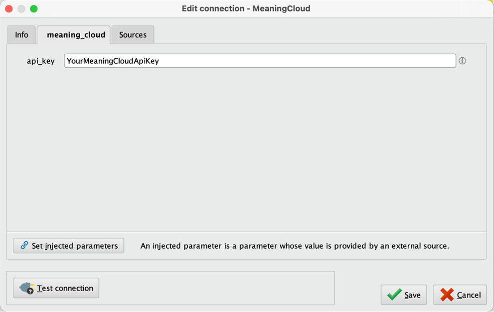

#### Add and Configure Process
Now that the needed pre-conditions the process can be imported and all connections and accesses can be established. Therefore, open RapidMiner Studio and select AI Hub as the repository.

##### Add Process

In the treeview in the tab Repository, select the menu item home>admin (or the user with which you want to run the process) and open the context menu. There, select the first item Store Process Here. This opens a new window where the name for the process can be selected. Save and open the new process.

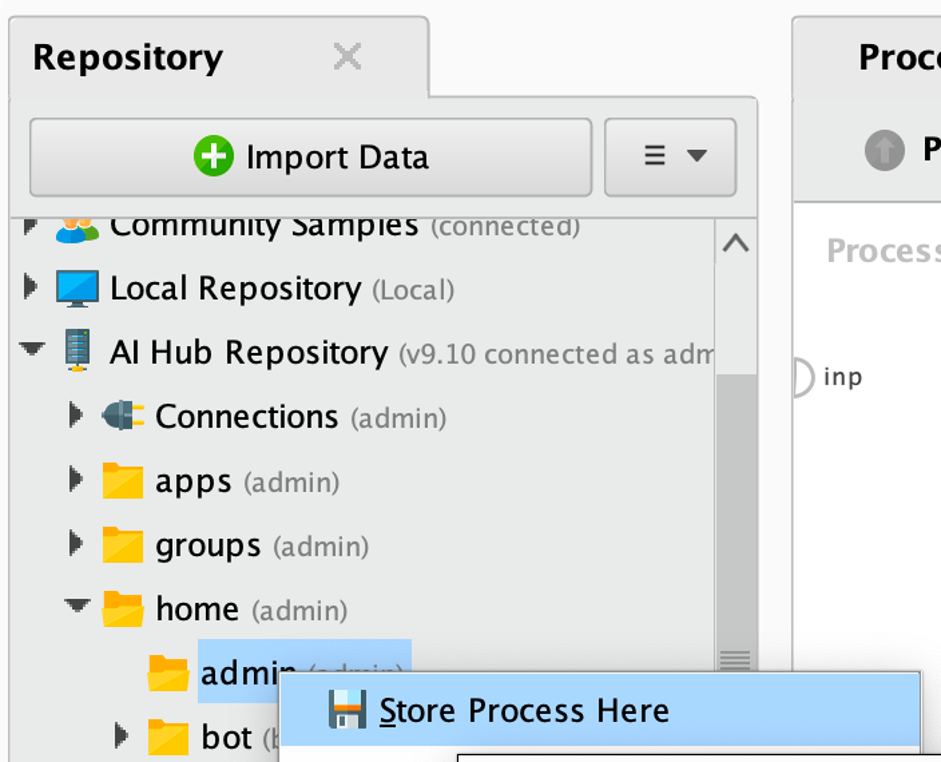

To add the process to RapidMiner, we recommend to enable the panel XML.

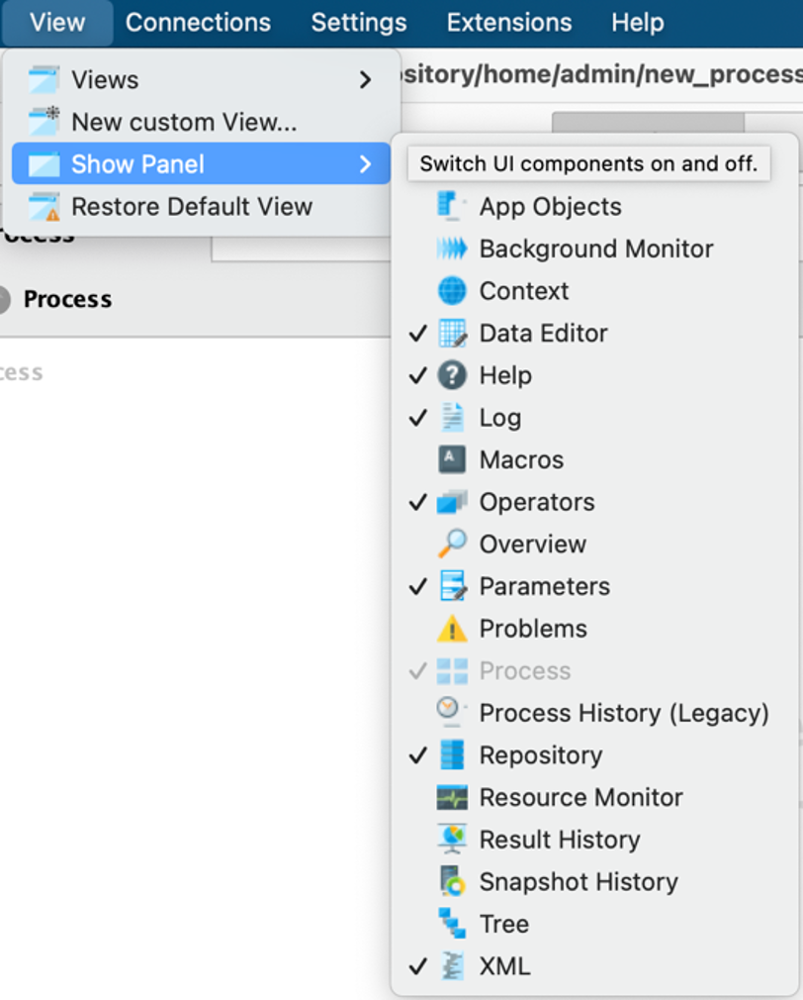

In the folder `RapidMiner`find the file `RapidMiner_Process.txt`. Open the file, copy its whole content and replace the current content in the XML view. Confirm it by pressing the green check.

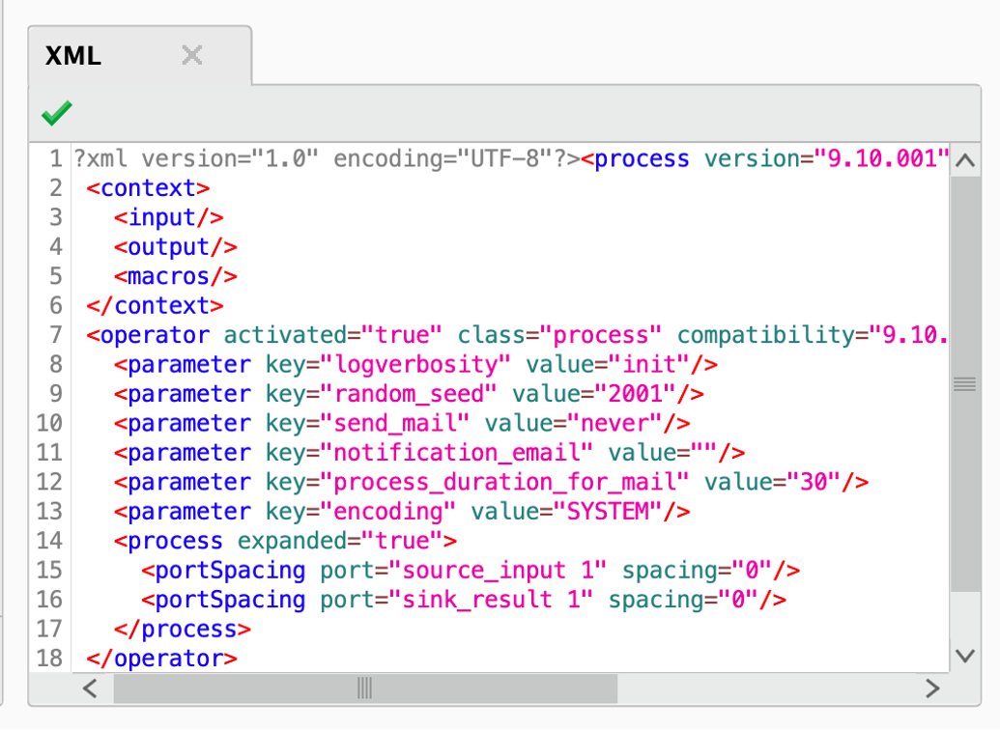

##### Add Connections

In the process there are several accesses of connections. More precisely, both the connection to the database and the connection to MeaningCloud are retrieved one time.

In the main process select the first operator “Retrieve pp”. In the parameters select the folder icon. In the window select the correct connection to the database.

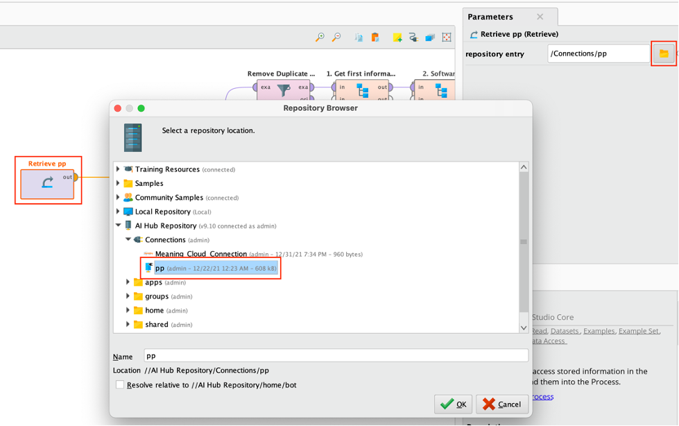

The same order has to be done for the MeaningCloud connection. In the sub-process of phase 4 select the connection operator and then the correct connection.

##### Add Accesses

In the process, there is an access to the already established programmable Google Search Engine. In the sub-process of phase 3 (Google SW) open the second operator Execute Python and on line 21 add the search engine id after cx=… and the personal API key key=… to enable the google search.

##### Import Data

There are two documents that have to be added. Both can be found in the folder RapidMiner. The files are called:
-	softwares_names
-	NLP_Filter_Words

To add those two files, select the button Import Data and in the view Repository. For each file, navigate to it and select it. To save it, select the place where you want.


In the sub-process of phase 2 (Software) select the upper operator Process Documents and select in the operator Retrieve NLP Filter Words the according file (NLP_Filter_Words).
The same has to be done for the other file (software_names). The process is analogously to adding a connection.

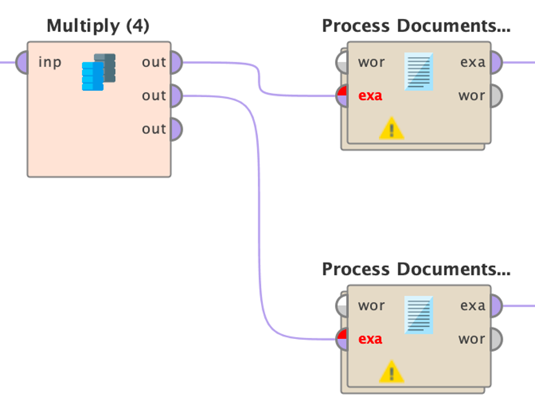

### Run Locally

To run the process locally first, some extensions need to be installed. On AI Hub the extensions are installed already. Further, as Python is used in the process, it has to be installed on the machine where it is run. Further, some packages are needed.

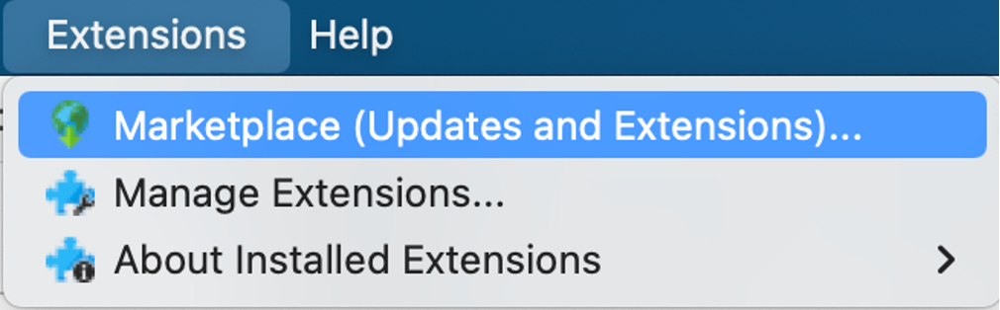

#### Install Extensions

The following extensions need to be installed:
-	Operator Toolbox
-	Text Processing
-	Web Mining
     Said extensions can be added using the marketplace.


#### Install Python and Packages

It is recommended to install the current version of Python because it has been developed based on that.
The following packages need to be installed:
-	pandas
-	requests
     Therefore, a file is prepared to install the packages. In the terminal type pip install -r RapidMiner/requirements.txt.

Now all required extensions and packages are installed.

To be able to run the process locally, all connections that have been established on the I Hub have to be established locally as well. Further, all imported data also has to be imported. After this is done, the process can be run locally.

## WebApplication Scouti

There are mainly two locations where the application can be installed. Either locally on a personal machine or on a server. This chapter describes in detail how to deploy the application on a server and briefly shows how to deploy it locally.

### Installation on Server
#### Preconditions
To install the application, it is recommended to run a Linux server. Any other type will also work (when done manually). More precisely, a script is provided to install all dependencies and packages and also a web-server. This script is developed and optimized for an Ubuntu server. It can be found in the folder Scripts. Other types of OS are not officially supported.

This installation guide assumes that a new server is deployed.

#### Installation
Ssh into the server and check if wget is installed – if not install wget.

If wget is installed, the script can be loaded:
```
wget https://raw.githubusercontent.com/MathisHermann/scripts/main/install_complete.sh
```

And afterwards run:
```
sudo bash install_complete.sh -n
```

This loads the script, installs all PHP packages, the web server (nginx), and further tools that are needed (git, curl, unzip, etc.). When the script has run successfully, the system reboots automatically. To test if nginx is running, visit 127.0.0.1 in the web-browser. A message similar to “**Welcome to Nginx! …**”.

Now run:
```
bash install_complete.sh -a
```

This command clones the repository and installs the application. It **must not be run with sudo** because: Never run composer with such privileges!
Further, the script opens the .env file. See the section Configuration for further information.

After a successful installation the last step is to configure the nginx web server:
```
sudo bash install_complete.sh -c
```

The application is now up and running.

#### Installation Locally
To run the application locally, there are several ways. We do not cover in detail how to run it but rather show where to look up for information:
-	MacOS:	Valet - https://laravel.com/docs/8.x/valet
-	Windows:	https://laravel.com/docs/8.x/installation#getting-started-on-windows
-	Linux:	https://laravel.com/docs/8.x/installation#getting-started-on-linux

#### Configuration
The configuration is done entirely in the .env file which can be found in the folder /www/html/scouti/.env – when using the terminal the file can be edited with:
`$ nano /www/html/scouti/.env`
     Edit the following entries:
```
GOOGLE_API_KEY=
GOOGLE_SEARCH_ENGINE_1_ID=

RAPID_MINER_ADDRESS=
RAPID_MINER_USER=
RAPID_MINER_PASSWORD=

DB_CONNECTION=mysql
DB_HOST=
DB_PORT=3306
DB_DATABASE=
DB_USERNAME=
DB_PASSWORD=
```

Now, the application can be accessed and run. Happy scouting.

## Hot Stuff

Find some helpful hot stuff in here.

### Videos

<!--- We have prepared several videos for the deployment, configuration and usage of Scouti. --->
There are several videos in production that will explain some crucial steps.

- Deployment RapidMiner AI Hub:
- Configuration RapidMiner Process:
- Deployment web application:
- Configuration web application:
- Usage Scouti:

### Table of Keys and IDs

Enter the keys and IDs needed for the configuration in this table such that they are always available:

| Name      | Key / ID | Usage |
| ----------- | ----------- |---|
| Google Search Engine 1:  ID (cx=…) |(without cx)| App|
| Google Search Engine 2: ID (cx=…) |(without cx)| RM|
| Personal Google API Key	| |	App / RM|
| MeaningCloud API Key| | RM|
| RapidMiner Address | | App|
| RapidMiner User	| |App|
| RapidMiner Password | |App|
| Database Name | | App / RM|
| Database Host | | App / RM|
| Database Port | | App / RM|
| Database User | | App / RM|
| Database Password | | App / RM|
